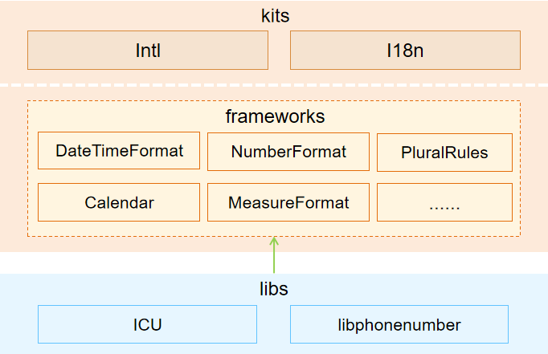

# 国际化部件

## 简介

**国际化部件**为应用提供了一系列国际化接口，包括：时间日期格式化、相对时间格式化、数字格式化、排序、单复数、日历、电话号码格式化、度量衡、字符属性、时区、音译、本地化数字、24小时制、换行符、索引、系统语言、系统地区、系统区域、偏好语言等相关接口。基于这些国际化接口，开发者可以设计并实现具有良好国际化能力的应用，从而可以高效、低成本的实现应用的本地化。国际化部件支持如下设备：润和DAYU200 RK3568。



**国际化部件架构图说明:**

- **Kits**为对外提供的js接口，分为intl和i18n两个模块。intl模块中包含了在ECMA 402标准定义的国际化接口，i18n模块包含了其他非ECMA 402定义的国际化接口。

- **frameworks**为js接口的底层c++实现。

- **libs**为js接口所依赖的国际化数据，包括ICU和libphonenumber两部分。


## 目录

国际化组件源代码目录结构如下所示：

```
/base/global/
├── i18n                    # 国际化框架代码仓
│   ├── frameworks          # 国际化框架核心代码
│   ├── interfaces          # 国际化框架接口
│   │   ├── js              # 国际化框架JavaScript接口
│   │   └── native          # 国际化框架native接口
```

## 约束

**语言限制**：JavaScript语言

**支持范围限制**：支持的语言符合 ISO 639 标准 2 字母或 3 字母语言码，支持的文本符合 ISO 15924 标准 4 字母文本码，支持的国家符合 ISO 3166 标准 2 字母国家码。


## 相关仓

[全球化子系统](https://gitee.com/openharmony/docs/blob/master/zh-cn/readme/%E5%85%A8%E7%90%83%E5%8C%96%E5%AD%90%E7%B3%BB%E7%BB%9F.md)

[global\_resource\_management](https://gitee.com/openharmony/global_resource_management/blob/master/README_zh.md)
